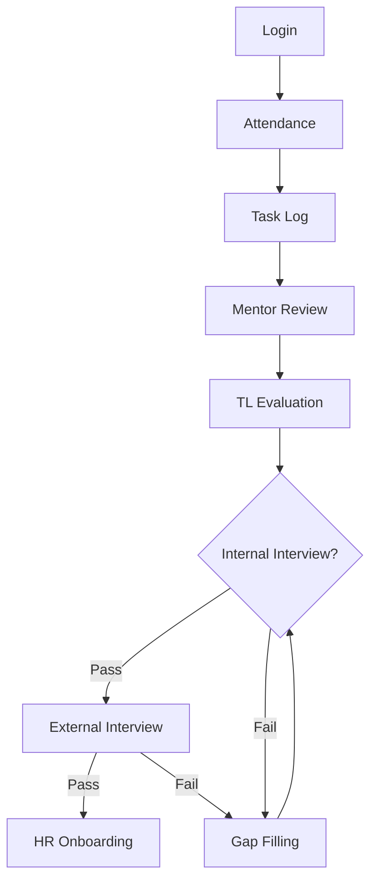

# **Time Sheet Tracer Project**  

## **1. Introduction**  
The **Time Sheet Tracer** is a comprehensive performance tracking system designed to monitor employees or candidates on an hourly basis. It tracks attendance (login/logout), task completion, mentor evaluations, and overall performance reviews by Team Leads (TLs) and Managers. The system ensures that candidates meet performance benchmarks before proceeding to external interviews. If they fail, they undergo reassessment and gap-filling before retrying.  

---

## **2. Key Features**  

### **2.1 Attendance Tracking**  
- **Login/Logout Time Tracking**: Records exact login and logout times.  
- **Late Login & Early Logout Detection**: Flags discrepancies from standard working hours (9 hours/day).  
- **Full-Day Present/Absent Marking**: Auto-detects full-day presence based on logged hours.  

### **2.2 Task & Performance Tracking**  
- **Hourly Task Logging**: Employees/candidates log tasks hourly.  
- **Mentor Review & Rating**: Mentors provide hourly/daily feedback, ratings, and remarks.  
- **TL & Manager Oversight**: Team Leads review individual performance, while Managers assess team metrics.  

### **2.3 Evaluation & Progression Workflow**  
- **Mock & Internal Interviews**: Conducted to evaluate readiness.  
- **External Interview Approval**: Only successful candidates proceed.  
- **Reversion for Gaps**: Failed candidates re-enter training/mentorship.  
- **HR Handover**: Upon external interview success, Managers transfer candidates to HR for offer letters.  

### **2.4 Monitoring & Reporting**  
- **Real-Time Status Tracking**: Mentors, TLs, and Managers monitor progress.  
- **Remarks & Status History**: Full audit trail of feedback and status changes.  

---

## **3. Additional Features to Enhance the System**  

### **3.1 Automated Notifications & Alerts**  
- **Late Login/Early Logout Alerts** to employees and managers.  
- **Reminder for Pending Tasks/Reviews** for mentors and TLs.  
- **Interview Schedule Alerts** for candidates.  

### **3.2 Skill Gap Analysis & Training Modules**  
- **Automated Skill Assessment Reports** post-failure in evaluations.  
- **Suggested Training Modules** based on performance gaps.  

### **3.3 Performance Analytics Dashboard**  
- **Individual & Team Performance Trends** (graphs, productivity scores).  
- **Comparative Analysis** between team members.  

### **3.4 Integration with HR & Recruitment Systems**  
- **Seamless HR Handoff** for offer letter processing.  
- **Resume & Profile Sync** with external interview data.  

### **3.5 Role-Based Access Control (RBAC)**  
- **Mentors**: Can review and rate only assigned candidates.  
- **TLs**: Can see team-wide performance.  
- **Managers**: Can oversee multiple teams and approve promotions/interviews.  
- **HR**: Limited to onboarding processes post-approval.  

### **3.6 External Interview Feedback Loop**  
- **Client/External Interview Feedback** logged for future improvements.  
- **Rejection Reason Analysis** to refine training.  

---

## **4. Workflow Diagram**  

1. **Candidate/Employee** → Logs hours, completes tasks.  
2. **Mentor** → Reviews, rates, provides remarks.  
3. **TL** → Evaluates overall performance, approves for mock/internal interviews.  
4. **Manager** → Checks team performance, approves external interviews.  
5. **HR** → Issues offer letter upon success.  

**Failure Handling:**  
- If a candidate fails mock/internal interviews → Reverts to mentorship.  
- If a candidate fails external interviews → Restarts the process.
  
---

## **6. Conclusion**  
The **Time Sheet Tracer** ensures a structured performance evaluation system with accountability at each stage. By integrating attendance tracking, mentor feedback, and multi-level approvals, it optimizes workforce productivity and interview readiness. Additional features like skill gap analysis and automated alerts further enhance efficiency.  

---

## **Module Documentation**  

### **1. Authentication & Authorization Module**  
**Purpose**: Secure access control for all user roles.  
**Key Features**:  
- Role-based login (Candidate, Mentor, TL, Manager, HR)  
- Password reset with OTP verification  
- Session management  

---

### **2. Attendance Tracking Module**  
**Purpose**: Monitor employee presence and punctuality.  
**Key Features**:  
- Real-time login/logout recording  
- Late arrival/early departure alerts  
- Monthly attendance reports  

---

### **3. Task Management Module**  
**Purpose**: Track hourly task completion.  
**Key Features**:  
- Task creation with start/end timestamps  
- Priority tagging (Urgent/Normal)  
- Missed task notifications  

---

### **4. Mentor Review Module**  
**Purpose**: Evaluate candidate performance at granular level.  
**Key Features**:  
- 5-star rating system  
- Comment threads for feedback  
- Attachment support (screenshots/docs)  

---

### **5. TL Evaluation Module**  
**Purpose**: Weekly performance summaries for teams.  
**Key Features**:  
- Skill matrix visualization  
- Comparative team analytics  
- Promotion recommendation workflow  

---

### **6. Interview Management Module**  
**Submodules**:  
- **Internal Interviews**:  
  - Automated scheduling  
  - Scorecards (Technical/Behavioral)  
- **External Interviews**:  
  - Client feedback integration  
  - Offer negotiation tracker  

---

### **7. Gap Filling Module**  
**Purpose**: Address skill deficiencies post-failure.  
**Key Features**:  
- AI-recommended training plans  
- Progress tracking (0-100%)  
- Retry eligibility checks  

---

### **8. HR Onboarding Module**  
**Purpose**: Streamline post-interview hiring.  
**Key Features**:  
- Dynamic offer letter generation  
- Document submission portal  
- Onboarding task checklist  

---

### **9. Reporting & Analytics Module**  
**Purpose**: Data-driven decision making.  
**Key Features**:  
- Customizable dashboards  
- Export to Excel/PDF  
- Success probability predictions  

---

### **10. Notification Engine**  
**Purpose**: Keep stakeholders informed.  
**Key Features**:  
- Email/SMS alerts for deadlines  
- Interview reminders  
- System outage notifications  

---

### **11. Admin & Configuration Module**  
**Purpose**: Centralized system control.  
**Key Features**:  
- User role management  
- Holiday calendar configuration  
- Audit trails for compliance  

---

### **Workflow Diagram**  

---

**Notes**:  
- All modules integrate via REST APIs.  
- Data retention policies apply to audit logs.

