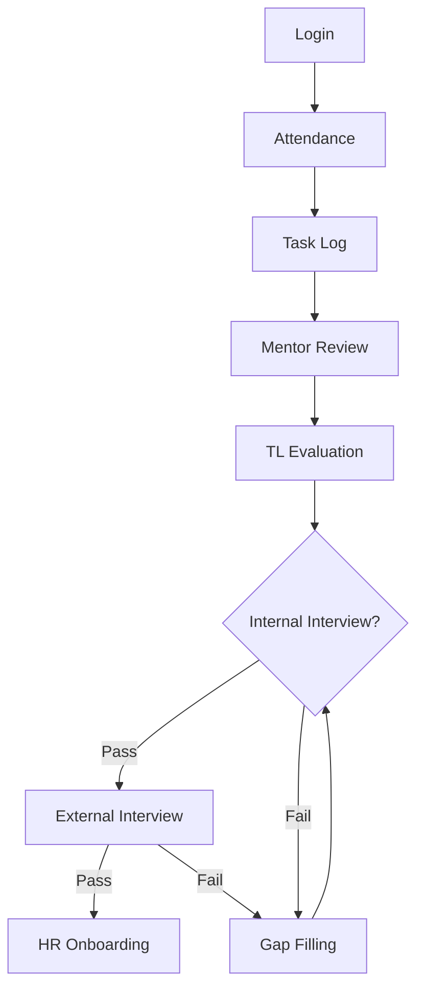

# **Time Sheet Tracer Project**  
## **Module Documentation**  

### **1. Authentication & Authorization Module**  
**Purpose**: Secure access control for all user roles.  
**Key Features**:  
- Role-based login (Candidate, Mentor, TL, Manager, HR)  
- Password reset with OTP verification  
- Session management  

---

### **2. Attendance Tracking Module**  
**Purpose**: Monitor employee presence and punctuality.  
**Key Features**:  
- Real-time login/logout recording  
- Late arrival/early departure alerts  
- Monthly attendance reports  

---

### **3. Task Management Module**  
**Purpose**: Track hourly task completion.  
**Key Features**:  
- Task creation with start/end timestamps  
- Priority tagging (Urgent/Normal)  
- Missed task notifications  

---

### **4. Mentor Review Module**  
**Purpose**: Evaluate candidate performance at granular level.  
**Key Features**:  
- 5-star rating system  
- Comment threads for feedback  
- Attachment support (screenshots/docs)  

---

### **5. TL Evaluation Module**  
**Purpose**: Weekly performance summaries for teams.  
**Key Features**:  
- Skill matrix visualization  
- Comparative team analytics  
- Promotion recommendation workflow  

---

### **6. Interview Management Module**  
**Submodules**:  
- **Internal Interviews**:  
  - Automated scheduling  
  - Scorecards (Technical/Behavioral)  
- **External Interviews**:  
  - Client feedback integration  
  - Offer negotiation tracker  

---

### **7. Gap Filling Module**  
**Purpose**: Address skill deficiencies post-failure.  
**Key Features**:  
- AI-recommended training plans  
- Progress tracking (0-100%)  
- Retry eligibility checks  

---

### **8. HR Onboarding Module**  
**Purpose**: Streamline post-interview hiring.  
**Key Features**:  
- Dynamic offer letter generation  
- Document submission portal  
- Onboarding task checklist  

---

### **9. Reporting & Analytics Module**  
**Purpose**: Data-driven decision making.  
**Key Features**:  
- Customizable dashboards  
- Export to Excel/PDF  
- Success probability predictions  

---

### **10. Notification Engine**  
**Purpose**: Keep stakeholders informed.  
**Key Features**:  
- Email/SMS alerts for deadlines  
- Interview reminders  
- System outage notifications  

---

### **11. Admin & Configuration Module**  
**Purpose**: Centralized system control.  
**Key Features**:  
- User role management  
- Holiday calendar configuration  
- Audit trails for compliance  

---

### **Workflow Diagram**  

---

**Notes**:  
- All modules integrate via REST APIs.  
- Data retention policies apply to audit logs.  
